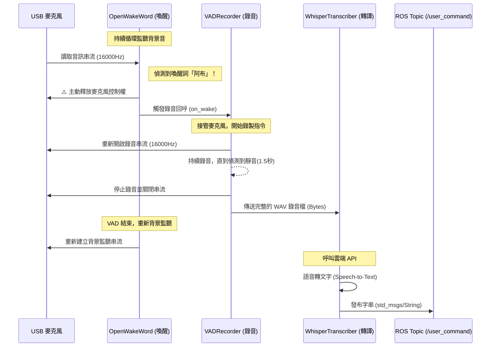

# ROS 語音助理模組架構說明 (Voice Module Architecture)

本語音模組 (`voice_node.py`) 採用「單一職責原則 (Single Responsibility Principle)」設計，將語音處理流程拆分為三個獨立運作的核心類別，並由 ROS 節點統籌排程。

此架構具備低延遲、抗雜訊干擾、硬體搶佔防護等特性，並能與後端的「大型語言模型 (LLM) 任務解析模組」無縫對接。

---

## 🏗️ 系統運作流程 (Architecture Flow)

整個語音指令的處理流程像是一場精密的「大隊接力」，一次只允許一個麥克風實例運作，以保護 Linux ALSA 底層音效鎖：

---

## 🧩 核心模組介紹 (Core Components)

### 1. `OpenWakeWordDetector` (喚醒詞引擎)
- **職責**：在背景中無限循環地聆聽麥克風，等待使用者說出特定的喚醒詞（本專案為 `abu.onnx`）。
- **技術細節**：
  - 運行在獨立的背景執行緒 (`threading.Thread`)，不阻塞主程式。
  - 使用輕量級的機器學習模型，具備高度抗噪能力。
  - **🛡️ 硬體防護機制**：為了讓後續模組可以順利錄音，當分數超過門檻 (Threshold: 0.4) 觸發時，會**立刻終止並釋放 (`terminate`) 自己的 PyAudio 實例**，避免發生 Linux 的 `Device unavailable` 錯誤。

### 2. `VADRecorder` (語音活動邊界偵測)
- **職責**：接手麥克風後，開始錄製使用者的命令內容，並精準判斷「一句話什麼時候說完」。
- **技術細節**：
  - 基於 Google 的 `webrtcvad` 技術，將聲音切成 30ms 的小片段分析。
  - **自動截斷**：當偵測到連續使用者安靜超過 1.5 秒（動態靜音門檻），就會自動停止錄音，回傳完整的 `WAV bytes` 包。
  - **防呆機制**：具有防護上限，如果收到持續的環境噪音，最多錄製 15 秒即強制結束。

### 3. `WhisperTranscriber` (語音轉文字)
- **職責**：將收到的 `WAV` 音檔轉換為精準的繁體中文文字。
- **技術細節**：
  - 將音檔轉化為 `ByteIO` 後直接向 OpenAI 的 Whisper-1 模型發送 API 請求。
  - 轉出人類可讀的自然語言文字（例如：「幫我把冰箱的可樂拿到餐廳」）。

### 4. `VoiceNode` (ROS 統籌排程器)
- **職責**：將上述三個模組串接，並作為 ROS 的發布者 (Publisher)。
- **通訊方式**：
  - **發布 Topic**：`/user_command` (`std_msgs/String`)。
  - **執行緒鎖 (Lock)**：使用 `threading.Lock()` 在同一時間只允許處理一個錄音任務，避免使用者連續呼叫「阿布、阿布」造成記憶體溢位或 API 頻繁請求。

---

## 💡 與後端 LLM 系統的銜接

語音模組完成後，這些繁體中文字串會直接進入 ROS 的 `/user_command` Topic。
此時由團隊另一組件 `high_level_node.py` (大腦解析器) 訂閱該主題。

它會將純文字的語音指令送給 LLM（大型語言模型），將其拆解為像 `[1] Deliver Cola to Dining Table` 等結構化的大任務 (JSON)，最終發送至 `/high_level_stream` 以供機器人真正執行移動與夾取動作。
